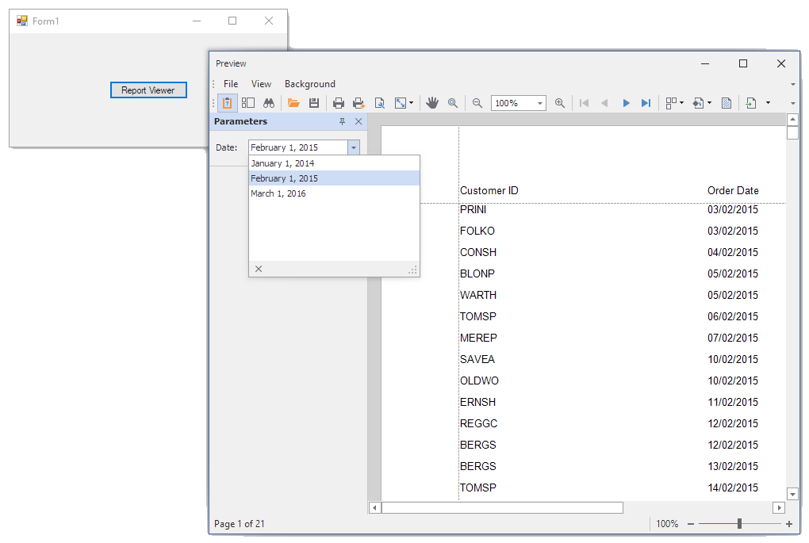

<!-- default badges list -->

<!-- default badges end -->
# Reporting for WinForms - Create a Report Parameter with a List of Predefined Static Values

This example demonstrates how to create a date report parameter with a list of predefined static values and use this parameter to filter the report's data.

 

## Files to Review

- [Form1.cs](CS/Form1.cs) ([Form1.vb](VB/Form1.vb))

## Documentation

- [Report Parameters with Predefined Static Values](https://docs.devexpress.com/XtraReports/401661/detailed-guide-to-devexpress-reporting/use-report-parameters/report-parameters-with-predefined-static-values?v=22.1)
- [Report Parameters with Predefined Dynamic Values](https://docs.devexpress.com/XtraReports/401662/detailed-guide-to-devexpress-reporting/use-report-parameters/report-parameters-with-predefined-dynamic-values?v=22.1)

## More Examples

- [Create a Report Parameter with a List of Predefined Dynamic Values](https://github.com/DevExpress-Examples/Reporting_how-to-assign-multiple-values-to-a-report-parameter-from-a-connected-data-source-t236094)
<!-- feedback -->
## Does this example address your development requirements/objectives?

 

(you will be redirected to DevExpress.com to submit your response)
<!-- feedback end -->
